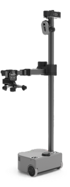
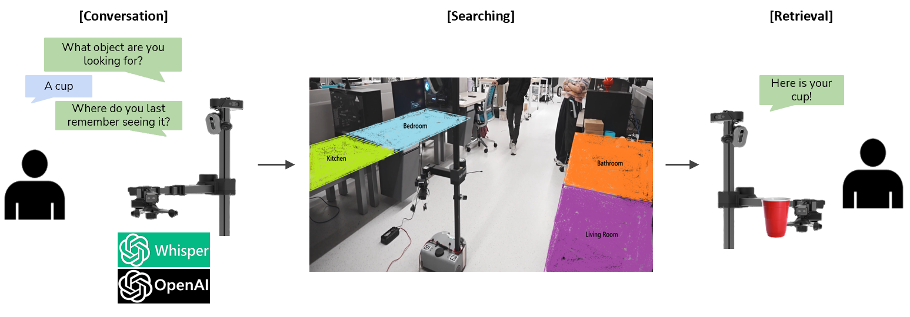
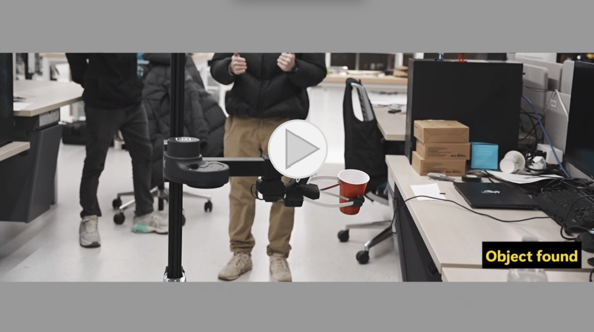

# Home Search Assistant: Stretch from Hello Robot
### Motivation:
The average time people spend for searching misplaced items like keys, cell phone, wallet etc., in a day is 10 minutes, a total of 3,650 minutes in a year or ~150 days in a lifetime. This is even higher for people with cognitive impairments or dementia.

### Objective:
To develop a conversational assistive search system built on Stretch Hello Robot to assist humans with everyday object finding tasks. Through multimodal capabalities, the robot can semantically search, locate and retrieve misplaced objects to the user. 
[Stretch Hello Robot](https://hello-robot.com/stretch-3-product)

### Solution:
* <ins>Conversation Pipeline</ins>: Uses large language model (LLM) to extract information about the object and location by having a conversation with the user.
* <ins>Vision Pipeline</ins>: For object search, detection and manipulation.

Integrated OpenAI LLM agent and Whisper model with Stretch robot. The user requests Stretch to find an object (cup). User audio is recorded using Stretch’s microphone and is transcribed using Whisper. The transcription is sent to LLM for processing and then LLM’s response is converted back to audio and outputted via Stretch’s speakers. Once Stretch got all necessary information from the user, it begins searching the rooms in the house. It semantically searchs rooms based on user input for faster and efficient search, giving less priority to other rooms. Once the object is detected, Stretch picks it up and drives back to the user.

* **Whisper OpenAI** ➡️ Audio transcription
* **GPT-5-nano OpenAI model** ➡️ LLM
* **YOLOv11 model** ➡️ Object detection
* **Intel Realsense RGBD Depth camera D435, D405** ➡️ Searching
* **Dex Wrist Gripper** ➡️ Object Manipulation
* **ReSpeaker MicArray** ➡️ Microphone, Speaker

We also conducted a within-subject study to understand the perceived trust and helpfulness of the robot among users. 
<ins>Baseline condition</ins>: Robot only knows the object name. Performs random room search. 
<ins>Experimental condition</ins>: Gathers information about the object and location. Performs semantic search through multimodal interaction.

### Demo:

### Conclusion:
Our findings indicate that users have strong confidence in the concept of employing robots for household assistance. This reflects a genuine societal need and aligns with emerging trends in domestic robotics. The experimental condition stood out to be more helpful and trustworthy.
